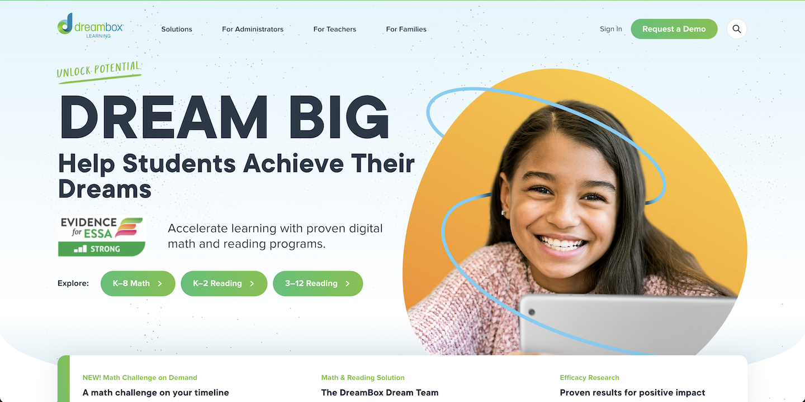
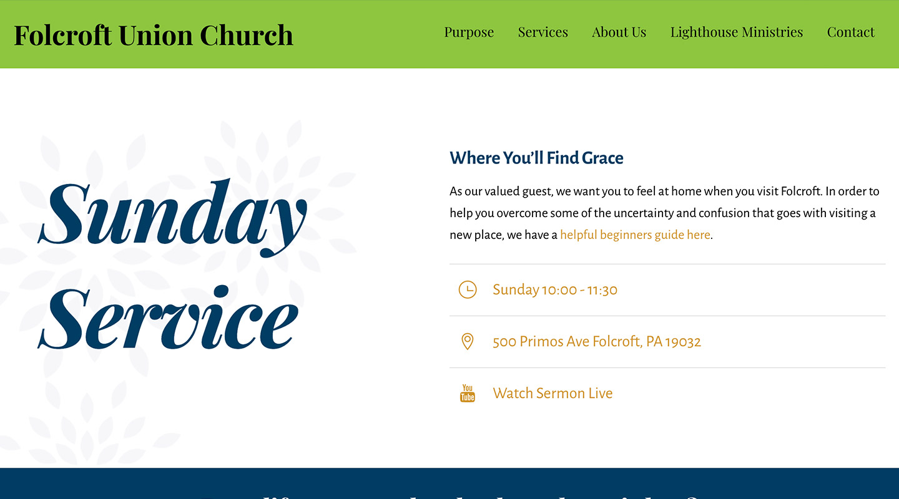
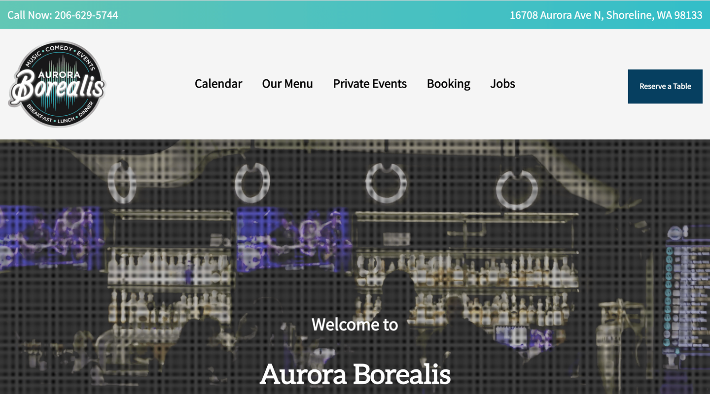
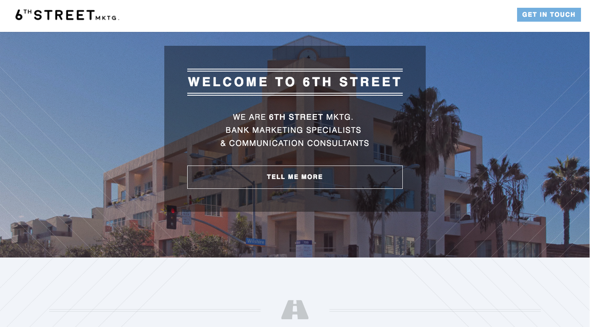
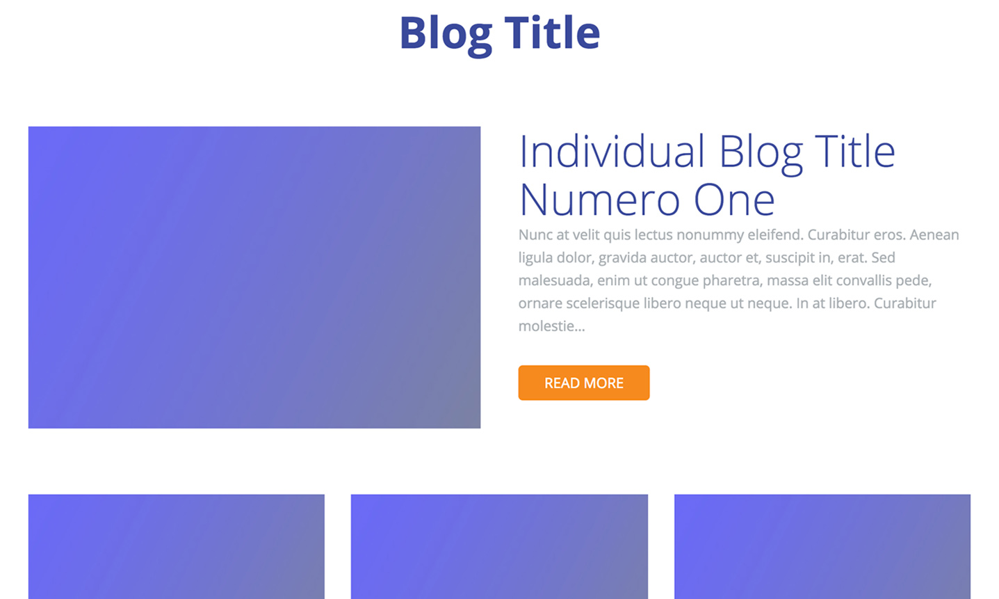
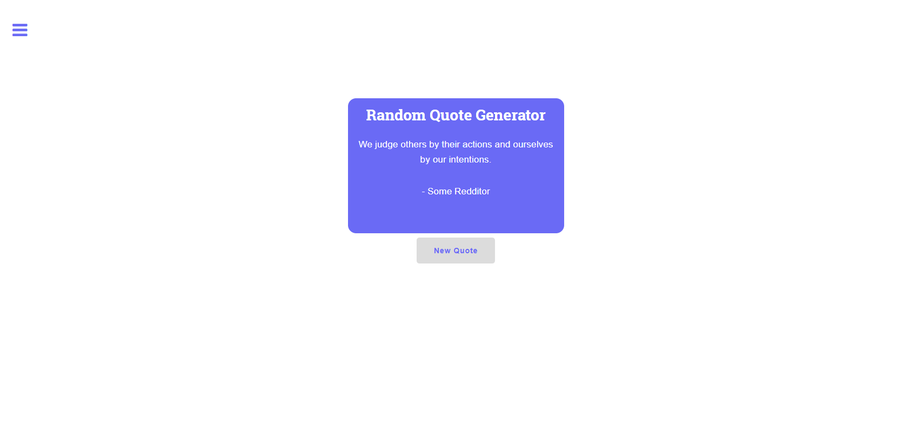
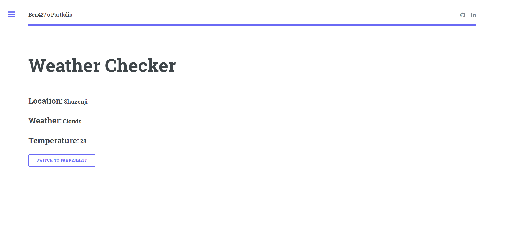

<!-- Section -->
<!--<section>
	<header class="major">
		<h2>Erat lacinia</h2>
	</header>
	

		<article>
			
			

				<h3>Portitor ullamcorper</h3>
				
Aenean ornare velit lacus, ac varius enim lorem ullamcorper dolore. Proin aliquam facilisis ante interdum. Sed nulla amet lorem feugiat tempus aliquam.

			

		</article>
		<article>
			
			

				<h3>Sapien veroeros</h3>
				
Aenean ornare velit lacus, ac varius enim lorem ullamcorper dolore. Proin aliquam facilisis ante interdum. Sed nulla amet lorem feugiat tempus aliquam.

			

		</article>
		<article>
			
			

				<h3>Quam lorem ipsum</h3>
				
Aenean ornare velit lacus, ac varius enim lorem ullamcorper dolore. Proin aliquam facilisis ante interdum. Sed nulla amet lorem feugiat tempus aliquam.

			

		</article>
		<article>
			
			

				<h3>Sed magna finibus</h3>
				
Aenean ornare velit lacus, ac varius enim lorem ullamcorper dolore. Proin aliquam facilisis ante interdum. Sed nulla amet lorem feugiat tempus aliquam.

			

		</article>
	

</section>-->

<!-- Section -->
<section>
	<header class="major">
		<h2>Projects</h2>
	</header>
	

	<article>
		
		<h3>DreamBox</h3>
		
Project includes ongoing content management and maintenance. Currently working on redesigning and relaunching several pages. So far the homepage is the first that has been fully redesigned and rebuilt by me!

		<ul class="actions">
			<li><a href="https://www.dreambox.com" class="button" target="_blank">See it live</a></li>
		</ul>
	</article>
	<article>
		
		<h3>Meed Banking Club</h3>
		
General website management on a JAM-stack utilizing Gatsby and Contenful. Some design work by me including cell phone and debit card images.

		<ul class="actions">
			<li><a href="https://meedbankingclub.com" class="button" target="_blank">See it live</a></li>
		</ul>
	</article>
	<article>
		
		<h3>Folcroft Union Church</h3>
		
Designed and developed based off of the Themify Ultra WordPress theme. 

		<ul class="actions">
			<li><a href="http://stayconnectedtoday.org/" class="button" target="_blank">See it live</a></li>
		</ul>
	</article>
	<article>
		
		<h3>Aurora Borealis</h3>
		
Full design & development using a custom theme built from the ground up.

		<ul class="actions">
			<li><a href="https://borealisonaurora.com" class="button" target="_blank">See it live</a></li>
		</ul>
	</article>
		<article>
			
			<h3>Metrix Automation</h3>
			
Maintenance and style/layout updates based off of an existing WordPress site. Work included adding custom stylings, reworking several content layouts, and implementing proper SEO tags (title tags, meta descriptions, alt tags, H1s, etc.), and image optimization. 

			<ul class="actions">
				<li><a href="http://metrixautomation.com.au/" class="button" target="_blank">See it live</a></li>
			</ul>
		</article>
		<article>
			
			<h3>Grade My Meds</h3>
			
Fully designed and developed by me. Utilizing Jekyll and Adobe XD, I created a static landing page for a medical assistance startup.

			<ul class="actions">
				<li><a href="http://jdoegmm.github.io" class="button" target="_blank">See it live</a></li>
			</ul>
		</article>

		<article>
			
			<h3>6th Street Marketing</h3>
			
Designed and developed based off of an existing Jekyll theme. Work included updating CSS stylings, selecting imagery, reworking content layouts, adding email form functionality, adding See More functionality and a small bit of copywriting.

			<ul class="actions">
				<li><a href="https://bbordofsky.github.io/" class="button" target="_blank">See it live</a></li>
			</ul>
		</article>
		<!--<article>
			
			<h3>Basic Blog Design</h3>
			
CSS Grid seemed useful so I decided to play around with it. I put together a simple blog design and practiced implementing CSS Grid styles as I wrote it out. It's fully responsive and should work in the most recent version of most browsers.

			<ul class="actions">
				<li><a href="/blog-design" class="button">See it live</a></li>
			</ul>
		</article>-->
		<!--<article>
			
			<h3>JavaScript Mini Projects</h3>
			
Just a few small Javascript projects that I completed while working through freecodecamp.com.

			<ul class="actions">
				<li><a href="javascript-mini-projects" class="button">See it live</a></li>
			</ul>
		</article>-->
		<!--<article>
			
			<h3>Random Quote Generator</h3>
			
Another freecodecamp.com project. This one is a basic JavaScript quote generator. Currently it does not pull from an API to get quotes and instead grabs them from a hard coded list.

			<ul class="actions">
				<li><a href="/rqm" class="button">See it live</a></li>
			</ul>
		</article>-->
		<!--<article>
			
			<h3>Weather Checker</h3>
			
Another freecodecamp.com project. This one asks the user for his or her location and then presents the basics of the weather in that location. It also allows for switching between Celsius and Fahrenheit

			<ul class="actions">
				<li><a href="/weather" class="button">See it live</a></li>
			</ul>
		</article>-->
		<!--<article>
			
			<h3>T-Shirt Designs</h3>
			
A few t-shirt designs I put together to test out Amazon Merch.

			<ul class="actions">
				<li><a href="/shirts" class="button">See it live</a></li>
			</ul>
		</article>-->
		<!--<article>
			
			<h3>Tempus ullamcorper</h3>
			
Aenean ornare velit lacus, ac varius enim lorem ullamcorper dolore. Proin aliquam facilisis ante interdum. Sed nulla amet lorem feugiat tempus aliquam.

			<ul class="actions">
				<li><a href="#" class="button">More</a></li>
			</ul>
		</article>
		<article>
			
			<h3>Sed etiam facilis</h3>
			
Aenean ornare velit lacus, ac varius enim lorem ullamcorper dolore. Proin aliquam facilisis ante interdum. Sed nulla amet lorem feugiat tempus aliquam.

			<ul class="actions">
				<li><a href="#" class="button">More</a></li>
			</ul>
		</article>
		<article>
			
			<h3>Feugiat lorem aenean</h3>
			
Aenean ornare velit lacus, ac varius enim lorem ullamcorper dolore. Proin aliquam facilisis ante interdum. Sed nulla amet lorem feugiat tempus aliquam.

			<ul class="actions">
				<li><a href="#" class="button">More</a></li>
			</ul>
		</article>
		<article>
			
			<h3>Amet varius aliquam</h3>
			
Aenean ornare velit lacus, ac varius enim lorem ullamcorper dolore. Proin aliquam facilisis ante interdum. Sed nulla amet lorem feugiat tempus aliquam.

			<ul class="actions">
				<li><a href="#" class="button">More</a></li>
			</ul>
		</article>-->
	

</section>
