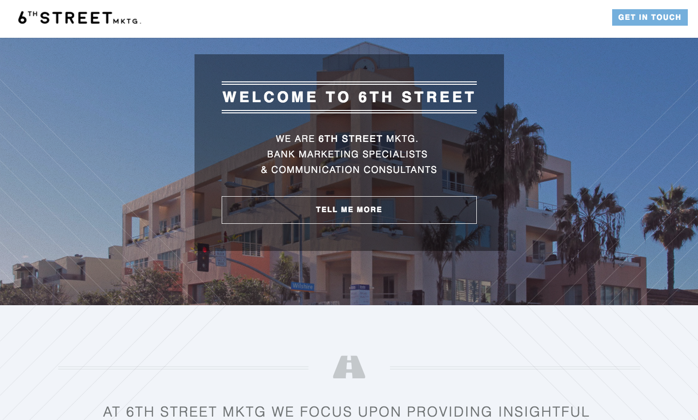

<!-- Section -->
<section>
	<header class="major">
		<h2>Erat lacinia</h2>
	</header>
	

		<article>
			
			

				<h3>Portitor ullamcorper</h3>
				
Aenean ornare velit lacus, ac varius enim lorem ullamcorper dolore. Proin aliquam facilisis ante interdum. Sed nulla amet lorem feugiat tempus aliquam.

			

		</article>
		<article>
			
			

				<h3>Sapien veroeros</h3>
				
Aenean ornare velit lacus, ac varius enim lorem ullamcorper dolore. Proin aliquam facilisis ante interdum. Sed nulla amet lorem feugiat tempus aliquam.

			

		</article>
		<article>
			
			

				<h3>Quam lorem ipsum</h3>
				
Aenean ornare velit lacus, ac varius enim lorem ullamcorper dolore. Proin aliquam facilisis ante interdum. Sed nulla amet lorem feugiat tempus aliquam.

			

		</article>
		<article>
			
			

				<h3>Sed magna finibus</h3>
				
Aenean ornare velit lacus, ac varius enim lorem ullamcorper dolore. Proin aliquam facilisis ante interdum. Sed nulla amet lorem feugiat tempus aliquam.

			

		</article>
	

</section>

<!-- Section -->
<section>
	<header class="major">
		<h2>Projects</h2>
	</header>
	

		<article>
			
			<h3>Metrix Automation</h3>
			
Maintenance and style/layout updates based off of an existing WordPress site. Work included adding custom stylings, reworking several content layouts, and implementing proper SEO tags (title tags, meta descriptions, alt tags, H1s, etc.), and image optimization. 

			<ul class="actions">
				<li><a href="http://metrixautomation.com.au/" class="button">See it live</a></li>
			</ul>
		</article>
		<article>
			
			<h3>6th Street Marketing</h3>
			
Designed and developed based off of an existing Jekyll theme. Work included updating CSS stylings, selecting imagery, reworking content layouts, adding email form functionality, adding See More functionality and a small bit of copywriting.

			<ul class="actions">
				<li><a href="https://bbordofsky.github.io/" class="button">See it live</a></li>
			</ul>
		</article>
		<article>
			
			<h3>Tempus ullamcorper</h3>
			
Aenean ornare velit lacus, ac varius enim lorem ullamcorper dolore. Proin aliquam facilisis ante interdum. Sed nulla amet lorem feugiat tempus aliquam.

			<ul class="actions">
				<li><a href="#" class="button">More</a></li>
			</ul>
		</article>
		<article>
			
			<h3>Sed etiam facilis</h3>
			
Aenean ornare velit lacus, ac varius enim lorem ullamcorper dolore. Proin aliquam facilisis ante interdum. Sed nulla amet lorem feugiat tempus aliquam.

			<ul class="actions">
				<li><a href="#" class="button">More</a></li>
			</ul>
		</article>
		<article>
			
			<h3>Feugiat lorem aenean</h3>
			
Aenean ornare velit lacus, ac varius enim lorem ullamcorper dolore. Proin aliquam facilisis ante interdum. Sed nulla amet lorem feugiat tempus aliquam.

			<ul class="actions">
				<li><a href="#" class="button">More</a></li>
			</ul>
		</article>
		<article>
			
			<h3>Amet varius aliquam</h3>
			
Aenean ornare velit lacus, ac varius enim lorem ullamcorper dolore. Proin aliquam facilisis ante interdum. Sed nulla amet lorem feugiat tempus aliquam.

			<ul class="actions">
				<li><a href="#" class="button">More</a></li>
			</ul>
		</article>
	

</section>
