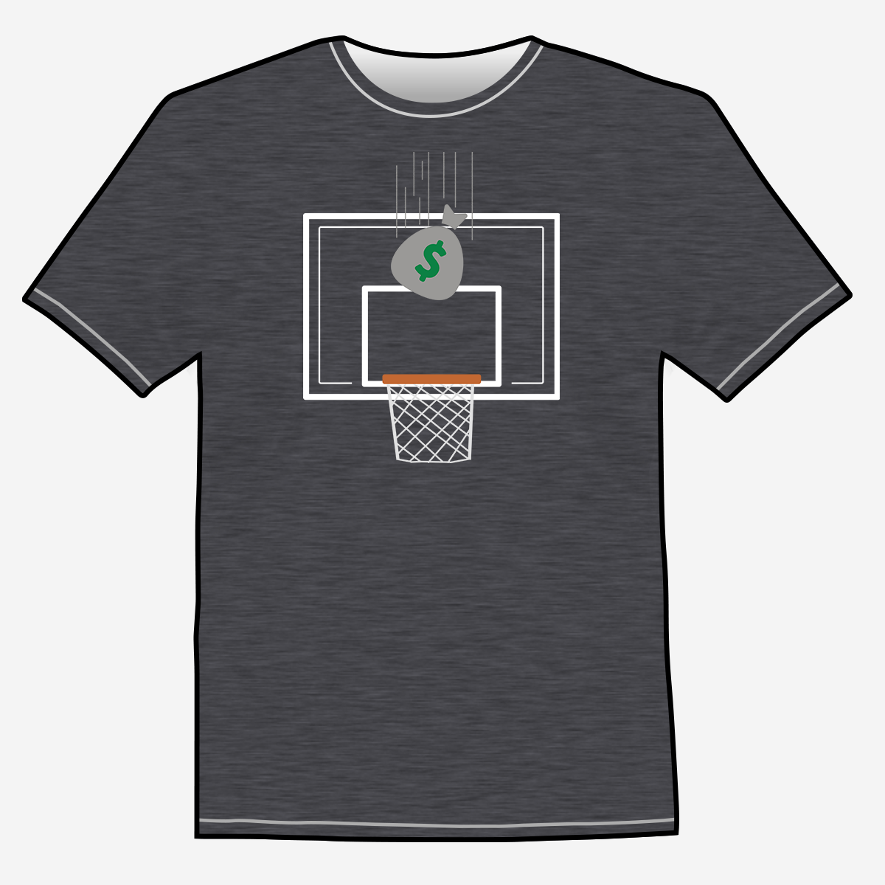
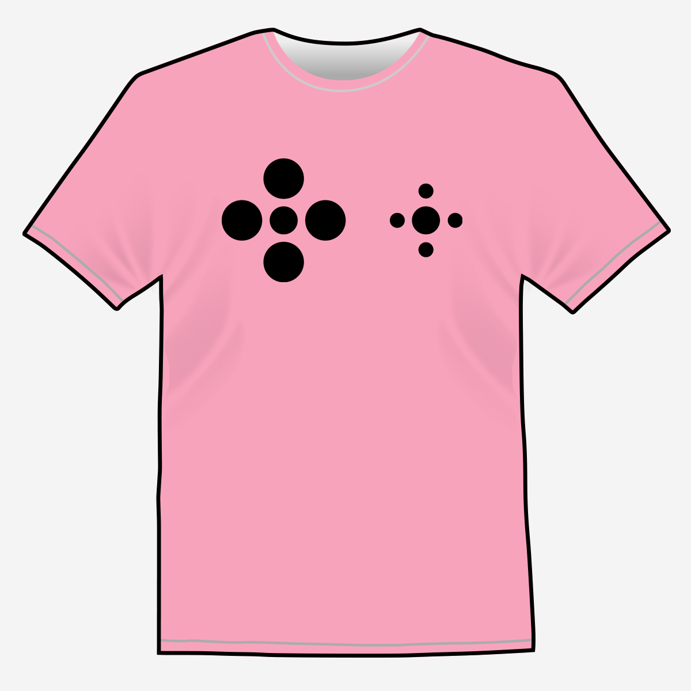
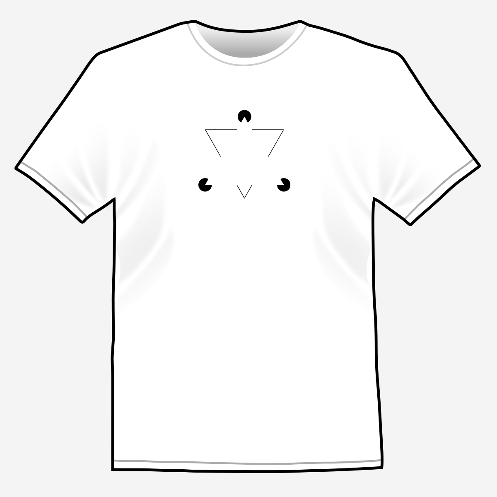
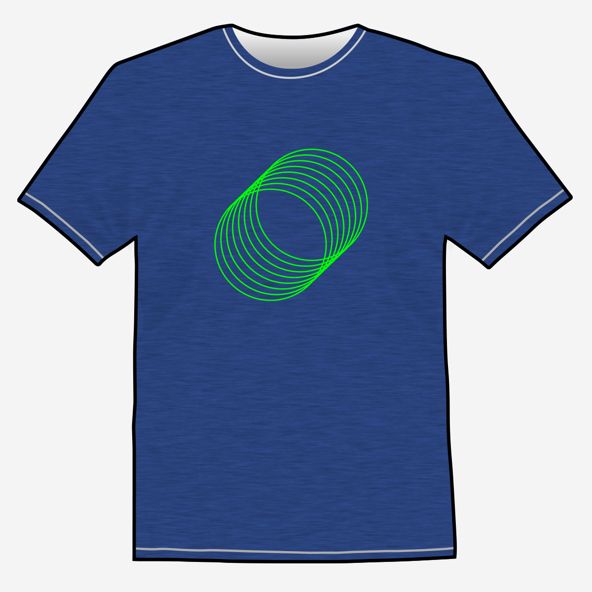
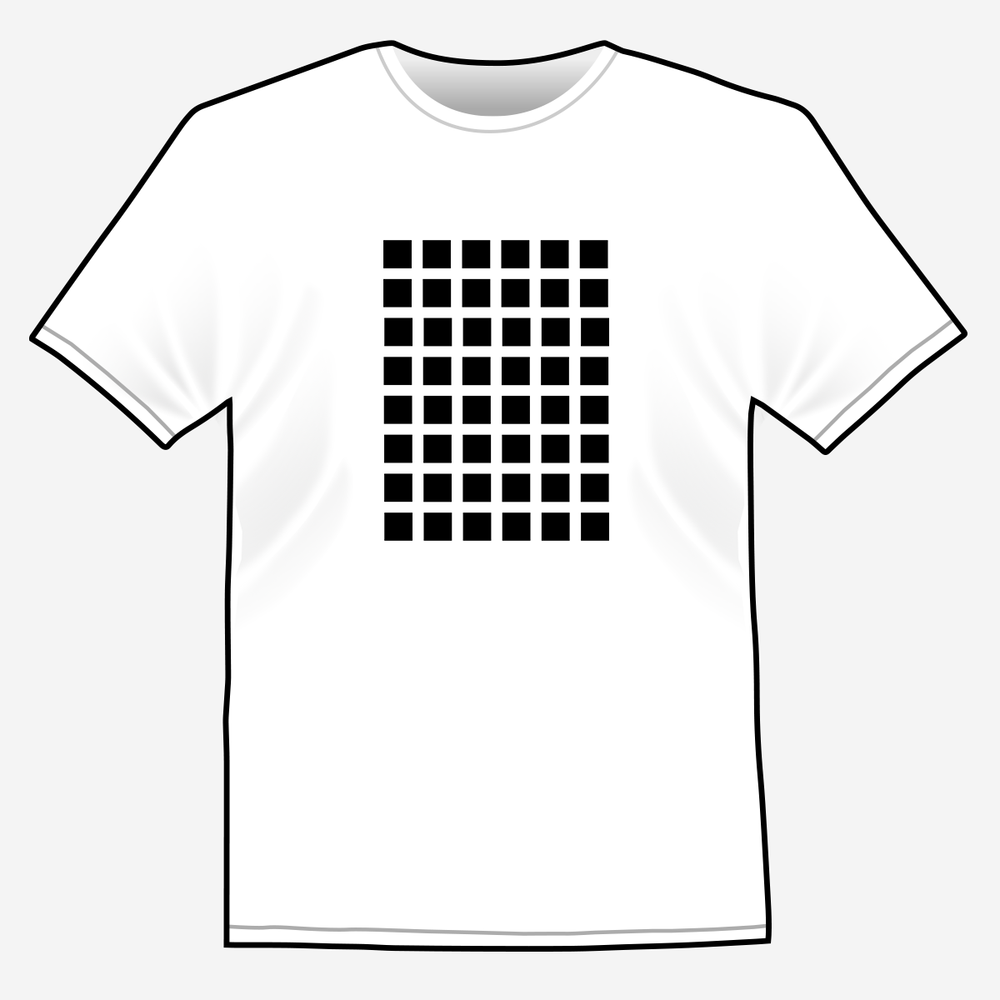

Since I had some spare time the last couple weeks and wanted to work on some design work, I decided to put together some t-shirts and throw them up on Amazon through their Merch program. You'll find all the designs I've created below and the ones that are live also have links to the product pages on Amazon.

	

		
<h3>Drop the Bag</h3>

		
<h3>That Middle School S</h3>

		
<h3>Strive for GOAT-ness</h3>

		<!-- Break -->
		
<h3>Arrows Illusion</h3>

		
<h3>Dots Illusion</h3>

		
<h3>Invisible Triangle Illusion</h3>

		<!-- Break -->
		
<h3>Overlapping Circles</h3>

		
<h3>Overlapping Rectangles</h3>

		
<h3>Squares/Dots Illusion</h3>

	

